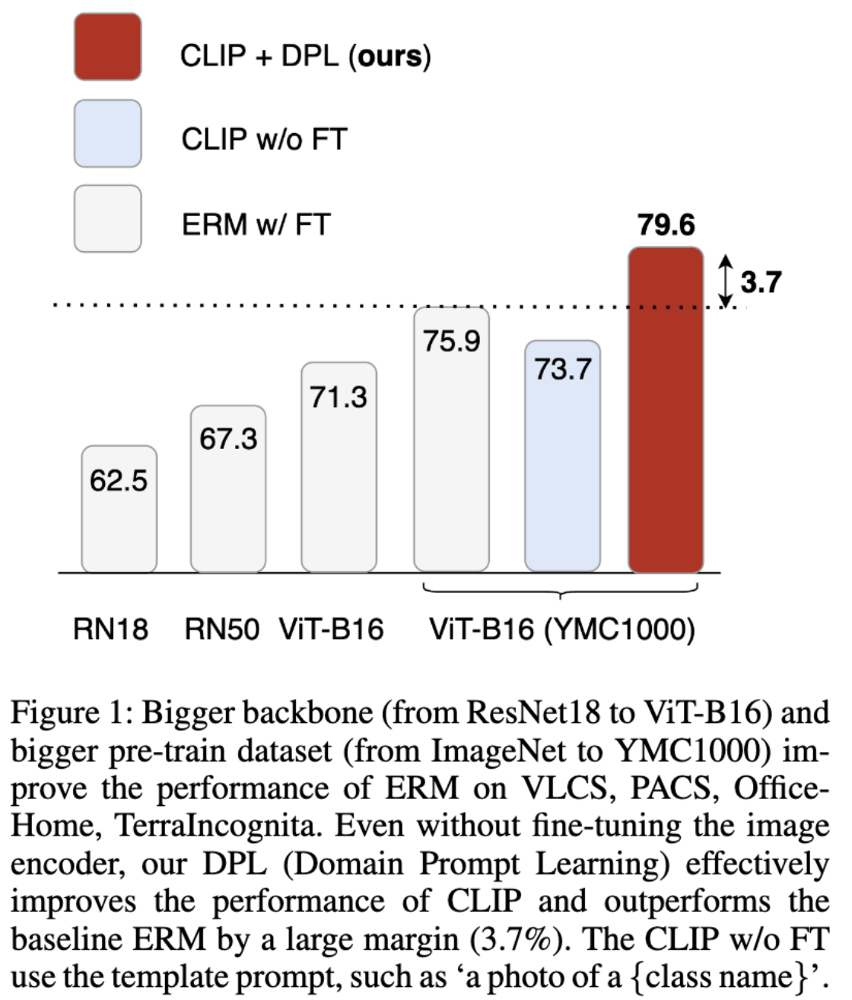
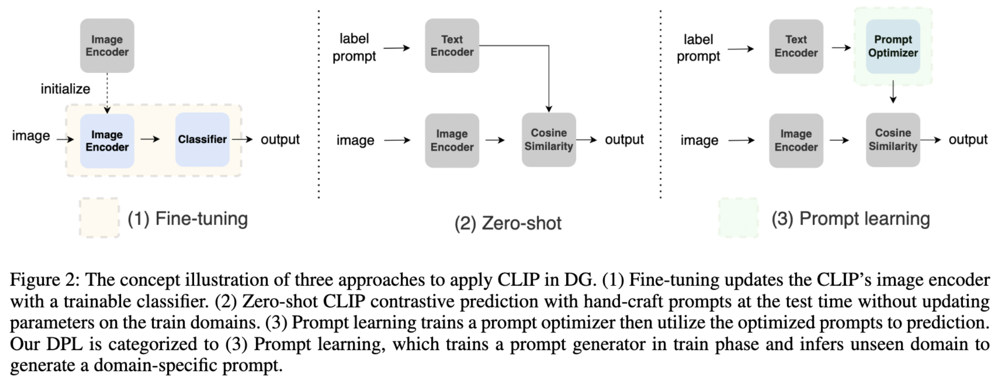
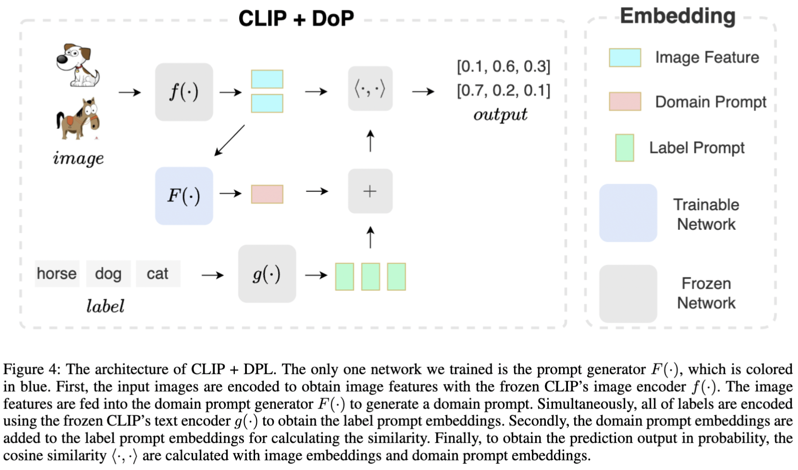
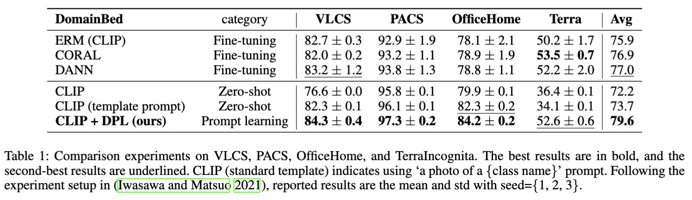
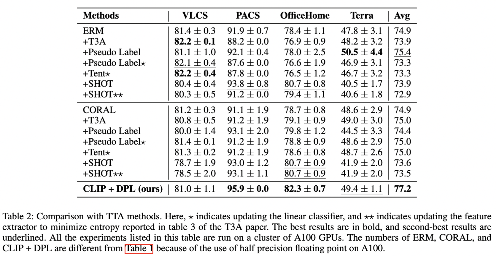
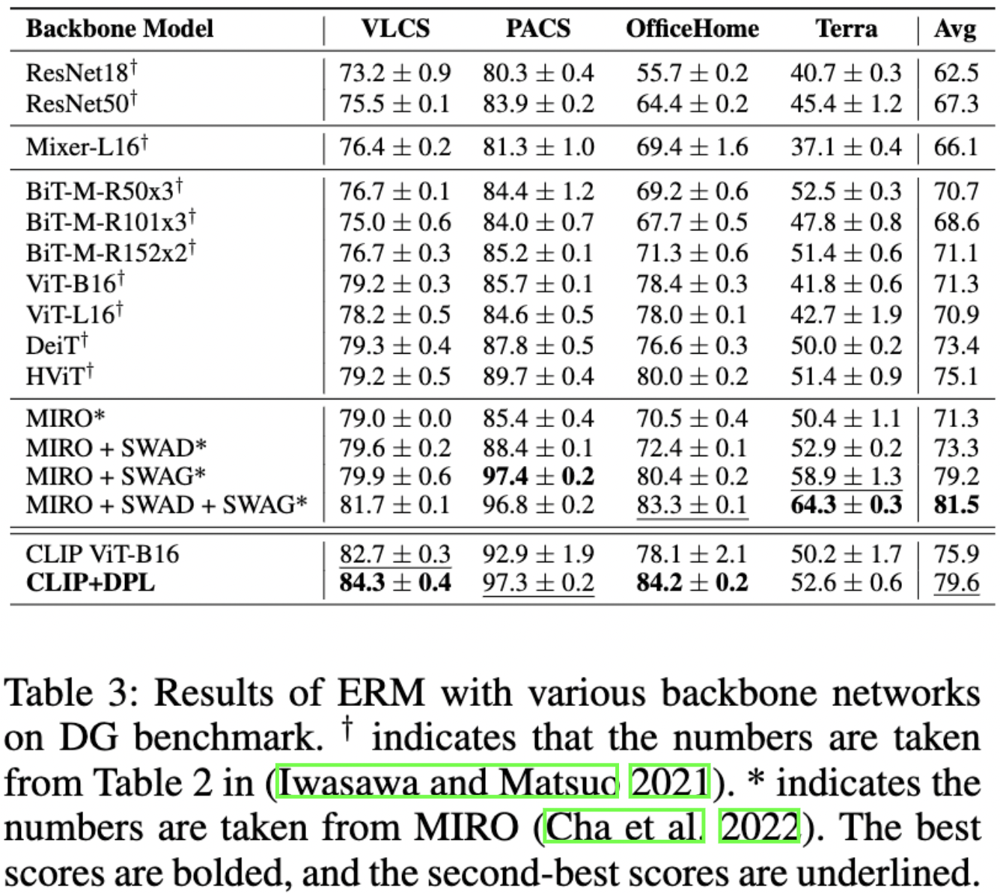
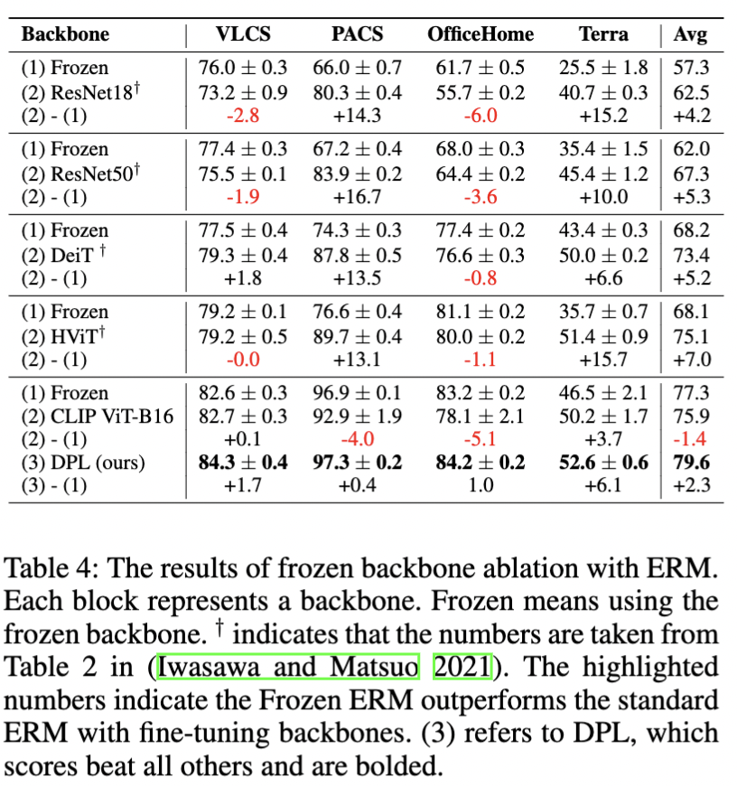

# Domain Prompt Learning for Efficiently Adapting CLIP to Unseen Domains

The official implementation of `Domain Prompt Learning for Efficiently Adapting CLIP to Unseen Domains` ([arxiv](https://arxiv.org/abs/2111.12853v3)).

This codebase is based on [T3A](<https://openreview.net/forum?id=e_yvNqkJKAW&referrer=%5BAuthor%20Console%5D(%2Fgroup%3Fid%3DNeurIPS.cc%2F2021%2FConference%2FAuthors%23your-submissions)>). 
and [DomainBed](https://github.com/facebookresearch/DomainBed).

## Overview of Domain Prompt Learning

Domain generalization (DG) is a difficult transfer learning problem aiming to learn a generalizable model for unseen domains. Recent foundation models (FMs) are robust to many distribution shifts and, therefore, should substantially improve the performance of DG. 

In this work, we study generic ways to adopt CLIP, a Visual-Language Foundation Model, for DG problems in image classification. While ERM greatly improves the accuracy with bigger backbones and training datasets using standard DG benchmarks, fine-tuning FMs is not practical in many real-world situations. 

We propose Domain Prompt Learning (DPL) as a novel approach for domain inference in the form of conditional prompt generation. DPL achieved a significant accuracy improvement with only training a lightweight prompt generator (a three-layer MLP), whose parameter is of equivalent scale to the classification projector in the previous DG literature. 

Combining DPL with CLIP provides surprising performance, raising the accuracy of zero-shot CLIP from 73.7% to 79.3% on several standard datasets, namely PACS, VLCS, OfficeHome, and TerraIncognita. We hope the simplicity and success of our approach lead to broader adoption and analysis of foundation models in the domain generalization field











## Installation

### 0. Python libralies

```sh
python3 -m venv ~/venv/dplclip
source ~/venv/dplclip/bin/activate
pip install -r requirements.txt
```


### 1. Download the datasets

```sh
python -m domainbed.scripts.download --data_dir=/my/datasets/path --dataset pacs
```
Note: change `--dataset pacs` for downloading other datasets (e.g., `vlcs`, `office_home`, `terra_incognita`). 


### 2. DG experiment scripts.

```sh    
python -m domainbed.scripts.train\
       --data_dir /my/datasets/path\
       --output_dir /my/pretrain/path\
       --algorithm ALGORITHM\
       --dataset DATASET\
       --hparams "{\"backbone\": \"resnet50\"}" 
```
Note: change ` --algorithms ALGORITHM --dataset DATASET` for different experiments.


### 3. TTA experiment scripts. 
Which is based on model trained in DG experiments. 
Please also refer to [T3A](https://github.com/matsuolab/T3A).

```sh    
python -m domainbed.scripts.unsupervised_adaptation\
       --input_dir=/my/pretrain/path\
       --adapt_algorithm=T3A
```

Also you can use `domainbed/scripts/sweep.py` to run the compeleted experiment.

Note that which needs lots of computing and takes long times for all experiments!
```sh
python domainbed/scripts/sweep.py launch --data_dir=/home/datasets --output_dir=/output_dir/sweep_hparam/PACS --algorithms DPLCLIP --datasets PACS --test_envs [0]
```


## Main difference in DPLCLIP from the [T3A implementation](https://github.com/matsuolab/T3A).
1. The main code of algorithm is in `domainbed/algorithms.py`. 
2. The data transform of CLIP is implemented in `domainbed/datasets.py`. 
3. The scope of hyperparameters are defined in `domainbed/hparams_registry.py`. 
4. The implements of CLIP backbone for ERM, CORAL, and other methods are in `domainbed/networks.py`. 
5. The visualization of the results are in `domainbed/scripts/summarize_results.ipynb`, `domainbed/scripts/visualization_dlp_results.py`, `domainbed/scripts/visualization_tsne_datasets.py`. 


<details><summary>Implement CLIP in DomainBed</summary><div>

```python
class CLIP(Algorithm):
    def __init__(self, input_shape, num_classes, num_domains, hparams):
        super(CLIP, self).__init__(input_shape, num_classes, num_domains, hparams)
        self.hparams = hparams
        self.device = "cuda" if torch.cuda.is_available() else "cpu"
        
        self.clip_model = clip.load(self.hparams['clip_backbone'])[0].float()

        for param in self.clip_model.parameters():
            param.requires_grad = False
        
        print('Set self.clip_model.parameters.reguires_grad = False!')

        # embedding dim for image and text encoder.
        self.EMBEDDING_DIM = 512  # 
        
        classnames = [name.replace('_', ' ') for name in hparams['class_names']]
        self.prompt = torch.cat([clip.tokenize(f'a photo of a {ppt}') for ppt in classnames]).to(self.device)
        
    def update(self, minibatches, unlabeled=None):
        return {'loss': 0}
    
    def predict(self, x):
        logits_per_image, _ = self.clip_model(x, self.prompt)
        return logits_per_image.softmax(dim=-1)
```
</div></details>

<details><summary>Implement DPL for CLIP in DomainBed</summary><div>

```python
class DPLCLIP(CLIP):
    def __init__(self, input_shape, num_classes, num_domains, hparams, sentence_prompt=False):
        super(DPLCLIP, self).__init__(input_shape, num_classes, num_domains, hparams)

        #  initial prompt.
        prompt_prefix = ' '.join(['X'] * hparams['num_domain_tokens'])
        
        if sentence_prompt:
            print('Using sentence_prompt in DPLCLIP...')
            classnames = [f"a photo of a {name.replace('_', ' ')}" for name in hparams['class_names']]
        else:
            classnames = [name.replace('_', ' ') for name in hparams['class_names']]
        prompts = [prompt_prefix + ' ' + name + '.' for name in classnames]
        # prompts:  ['X X X X X X X X dog.', 'X X X X X X X X elephant.' ...]
        
        #  to get default token_prefix and token_suffix.
        self.tokenized_prompts = torch.cat([clip.tokenize(p) for p in prompts]).to(self.device)
        # tokenized_prompts[0] = tensor([49406,   343,   343,   343,   343,   343,   343,   343,   343,  1929, 269, 49407, 0, 0, ...])
        with torch.no_grad():
            embedding = self.clip_model.token_embedding(self.tokenized_prompts).type(self.clip_model.dtype)
        
        self.register_buffer('token_prefix', embedding[:, :1, :])  # SOS
        #  torch.Size([7, 1, 512])
        #  [-0.0001,  0.0002, -0.0046,  ...,  0.0010,  0.0025,  0.0049]
        
        self.register_buffer('token_suffix', embedding[:, hparams['num_domain_tokens'] + 1:, :])  # CLS, EOS
        # torch.Size([7, 68, self.EMBEDDING_DIM]), 68 := 77 - num_domain_tokens_tokens - 2.
        # [ 0.0013,  0.0046, -0.0115,  ...,  0.0112,  0.0147,  0.0040],...,.
        
        self.network = networks.MLP(self.EMBEDDING_DIM, self.EMBEDDING_DIM * hparams['num_domain_tokens'], hparams).to(device=self.device, dtype=self.clip_model.dtype)
        
        def init_weights(m):
            if isinstance(m, nn.Linear):
                torch.nn.init.xavier_uniform(m.weight)
                m.bias.data.fill_(0.01)
        
        self.network.apply(init_weights)
        
        # 
        self.optimizer = torch.optim.SGD(
            self.network.parameters(),
            lr=self.hparams["lr"],
            momentum=self.hparams["momentum"]
        )
            
    def update(self, minibatches, unlabeled=None):
        # train on three domains, test on one unseen doamin on PACS.
        # minibatches = [[domain_1], [domain_2], [domain_3]]
        all_x = [data[0].cuda().float() for data in minibatches]
        all_y = torch.cat([data[1].cuda().long() for data in minibatches])

        # encode image for each domain.
        image_features = [self.clip_model.encode_image(x) for x in all_x]
        
        # extract domain_feature for each domain. 
        # [32, self.EMBEDDING_DIM] -> [32, self.EMBEDDING_DIM * num_domain_tokens] -> [self.EMBEDDING_DIM * num_domain_tokens].
        domain_features = [self.network(feature) for feature in image_features]
        image_features = torch.cat(image_features)
        
        # get the domain feature!
        # reshape [self.batch_size, self.EMBEDDING_DIM.]:  -> [1, self.EMBEDDING_DIM.]
        mean_domain_features = [feature.mean(dim=0, keepdim=True) for feature in domain_features]

        # copy domain feature {the num of classes} times.
        # reshape [1, self.EMBEDDING_DIM.]:  -> [7, self.EMBEDDING_DIM.]
        _mean_domain_features = [feature.repeat_interleave(len(self.hparams['class_names']), dim=0) for feature in mean_domain_features]
        
        # Generate domain prompt.
        # generate text_feature from domain_feature. text_features.size = [3, 7, 512]
        # text_features = [self._get_text_features(feature) for feature in _mean_domain_features]
        text_features = torch.cat([self._get_text_features(feature) for feature in _mean_domain_features])
        
        # Contrastive prediction. refer to [github://openai/clip](https://github.com/openai/CLIP)
        image_features = image_features / image_features.norm(dim=-1, keepdim=True)
        text_features = text_features / text_features.norm(dim=-1, keepdim=True)
        logits_per_image = self.clip_model.logit_scale.exp() * image_features @ text_features.t()
        loss = F.cross_entropy(logits_per_image, all_y)
            
        self.optimizer.zero_grad()
        loss.backward()
        self.optimizer.step()
        return {"loss": loss.item()}


    def _get_text_features(self, domain_feature, coop=False):
        #  reshape domain_feature: [7, 16 * self.EMBEDDING_DIM] -> [7, 16, self.EMBEDDING_DIM]
        domain_feature = domain_feature.reshape(-1, self.hparams['num_domain_tokens'], self.EMBEDDING_DIM)
        
        #  reshape domain_feature: [7, 16, self.EMBEDDING_DIM] -> [7, 77, self.EMBEDDING_DIM]
        domain_feature = torch.cat([self.token_prefix, domain_feature, self.token_suffix], dim=1)
        
        #  refer CoOp: CoOP github. https://github.com/KaiyangZhou/CoOp/blob/b0a058869cef00a4e4ea5256d40fd7681119c099/trainers/coop.py#L46
        x = domain_feature + self.clip_model.positional_embedding.type(self.clip_model.dtype)
        x = x.permute(1, 0, 2)
        x = self.clip_model.transformer(x)
        x = x.permute(1, 0, 2)
        x = self.clip_model.ln_final(x).type(self.clip_model.dtype)
        
        #  mapping domain_features to text_features.
        text_features = x[torch.arange(x.shape[0]), self.tokenized_prompts.argmax(dim=-1)] @ self.clip_model.text_projection      
        return text_features

    def predict(self, x):
        image_feature = self.clip_model.encode_image(x)
        
        domain_feature = self.network(image_feature)
        mean_domain_feature = torch.mean(domain_feature, dim=0, keepdim=True).repeat_interleave(len(self.hparams['class_names']), dim=0)
        text_feature = self._get_text_features(mean_domain_feature)
        
        image_feature = image_feature / image_feature.norm(dim=-1, keepdim=True)
        text_feature = text_feature / text_feature.norm(dim=-1, keepdim=True)
        return self.clip_model.logit_scale.exp() * image_feature @ text_feature.t()

```
</div></details>

<details><summary>The hyperparameters.</summary><div>

The new parameters we added to DomainBed `hparams_registry.py`

```python
# the better num_domain_tokens should be 16 (refer to CoOp).
_hparam('num_domain_tokens', 16, lambda r: int(r.choice([2, 4, 8, 16])))

# MLP
_hparam('mlp_depth', 3, lambda r: int(r.choice([3])))
_hparam('mlp_width', 512, lambda r: int(r.choice([256, 512])))
_hparam('mlp_dropout', 0.1, lambda r: r.choice([0.0, 0.1]))

# optimizer
_hparam('lr', 1e-3, lambda r: 10**r.uniform(-4.5, -2.5))
_hparam('weight_decay', 0., lambda r: 0.)
_hparam('momentum', 0.1, lambda r: r.choice([0.0, 0.1, 0.2]))

```

</div></details>

## License

This source code is released under the MIT license, included [here](LICENSE).